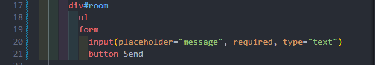
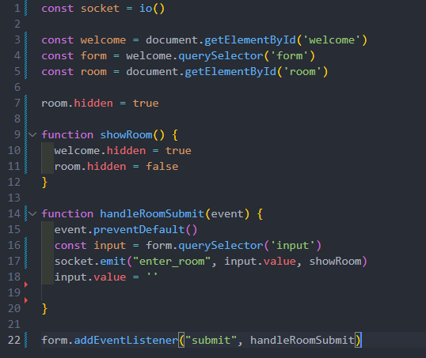
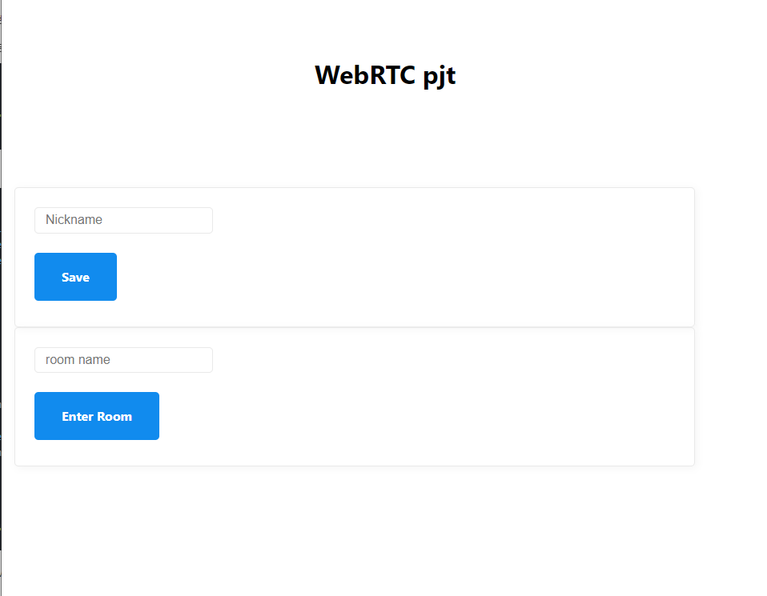
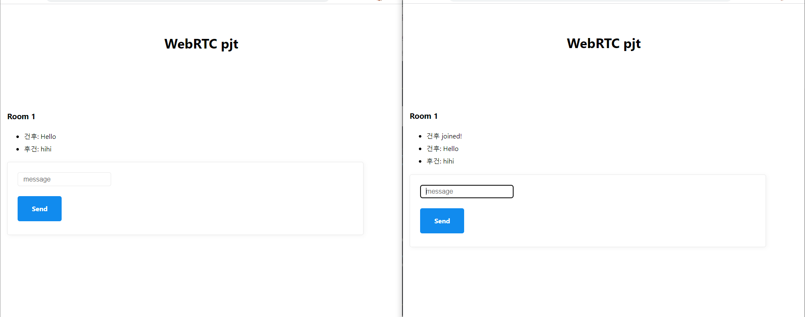

# Zoom Clone Coding

- WebRTC와 Websockets를 사용한 줌 클론 코딩 

# 1. Target

- WebRTC를 사용한 웹 기술 PJT 전 사전학습

- 웹소켓을 사용한 양방향 채팅서버 구현

# 2. Learned

### Chat

- Websockets, Socket.io 에 대한 학습을 진행.

- Sockec.io 의 emit 함수의 인자는 emit(이름, arg1, arg2, arg3 ... function) 식으로 맨 앞에는 해당 이벤트의 이름을, 맨 마지막에는 실행되는 함수를 적용시켜줘야 한다. (※ 신뢰 할 수 없는 코드는 Backend에 적지 않기. 보안위험)

- 접속 할 시, 방 이름 설정은 숨기고, 채팅기능은 보이도록
  
  

      (pug로 작성한 html) 

        

        enter_room의 이름을 통해 emit 으로 server를 통해 showRoom 함수를 실행시키게 

        된다면 room의 hidden 상태는 true -> false, welcome 상태는 false -> true가 된다.

- 사용자 편의를 위해 초기 화면을 변경
  

- 1:1 채팅 기능 구현 화면
  